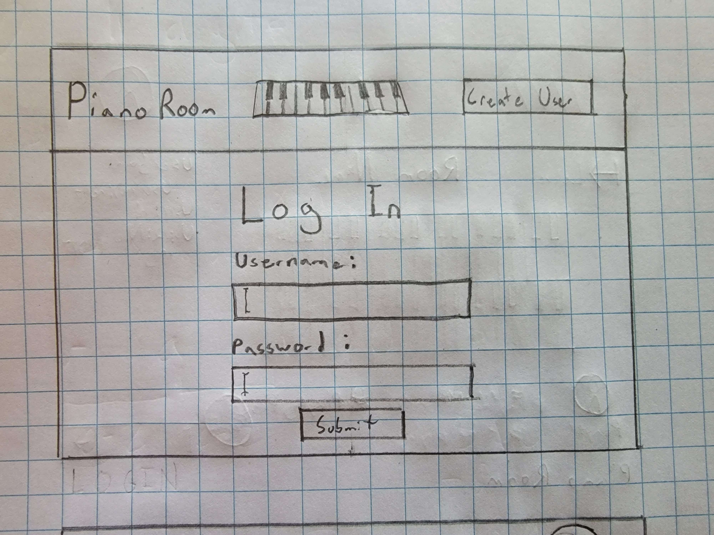
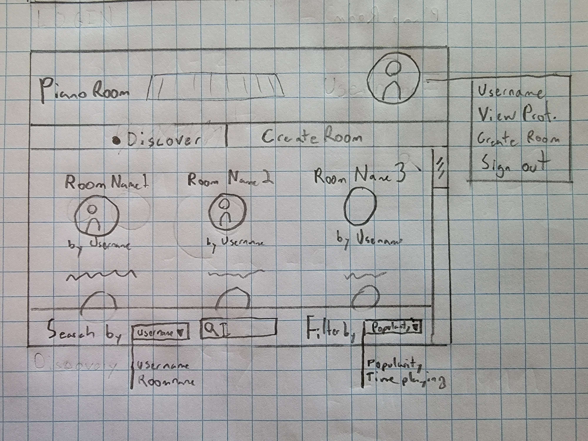
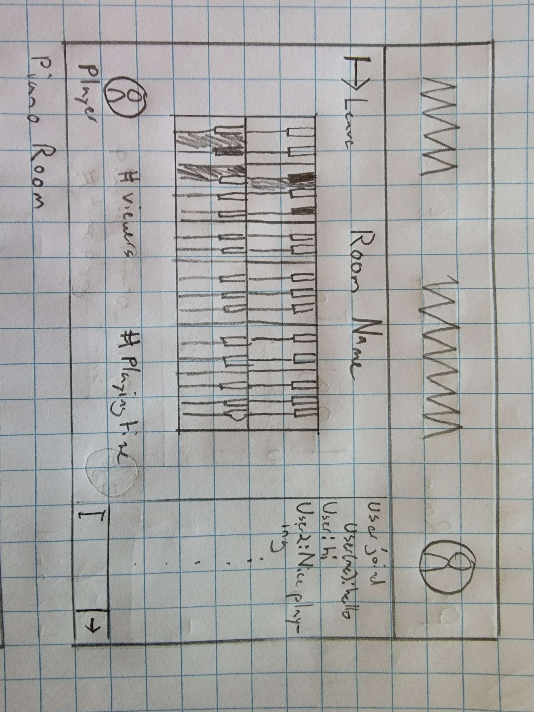

# Cristofori's Café
This application plans to allow piano players to share their talent and for communities to come together to listen. The player creates a public room to which people may come and go. Users coming to listen can look through popular room or search for one to their liking. In these rooms, players can play the piano using a graphical interface and notes played will be played to listeners realtime. While listening to the music, users can chat with one another, commenting on the music, or simply talking about any topics.

## Design

#### _Login Screen:_

#### _Discovery Screen:_

Allows users to view a selection of piano rooms and search/filter this view by a couple of parameters (username/room name) and (popularity/Time Playing)

#### _Piano Room Screen:_

This is the most complicated part of the app. This represents the viewer screen, the right side has a chat box notifing all users of people joining and messages by others. The center is consumed by a representation of a piano that displays keys and is only interactable to the piano player. Info/Stats about the room are given below the piano.

## Key features

- Secure login over HTTPS
- Search and filter parameters to manage many rooms by pagination.
- Display of various rooms to be selected by users
- Ability to join and leave various rooms
- Chat box allowing users to speak to one another in realtime
- Actual statistic for a room displayed/updated
- Ability for players to play notes on a piano
- Playing piano audio for all users in a room

## Technologies

I am going to use the required technologies in the following ways.

- **HTML** - Creates the structure of the application, mostly defining divisions, headers, panels, and text. There will be a combined total of 6 pages:
  1. Login
  2. Create User
  3. View/edit Profile
  4. Discovery
  5. Piano room (Listener)
  6. Piano room (Player)

- **CSS** - Stylizes the page allowing for centered, orderly design as well as smooth animation for scrolling through various room in the discovery screen.

- **JavaScript** - Allows for dynamic elements and calls to services such as searching and filtering piano rooms and actually playing audio from piano notes and displaying the notes played.

- **Service** - Backend service with endpoints for:
  - login
  - creating user
  - editing user
  - getting room stats
  - retrieving public rooms by parameters
  - joining a room

- **Authentication** - Users must login in through password which will be stored with a hash

- **Database** - Stores users, rooms, credentials, and chat history. The app is not designed to hold recording of music played and will simply play realtime music. Chat history will be cycled meaning that only the last 5 minutes of messages are kept.

- **WebSocket** - This is used in 2 places:
  1. Chat messages are relayed to all players as well as info messages such as `viewer joined`
  2. Piano notes are relayed from the piano player to all listeners.

- **React** - Application ported to use the React web framework.

## HTML deliverable

For this deliverable I built out the structure of my application using HTML.

- **HTML pages** - Seven HTML page that represent the ability to login, create a user, create a room, search for a room, and watch a room as a listener and a piano player.
- **Links** - The login page automatically links to the create_user page and discover page. Every page after login contains a link to the login page as well as the view_profile page. The discovery page contains links to the player_room page and listener_room page.
- **Text** - Text is represented on almost every level. Text is on the player profile as bio. Text is also present in descriptions of the rooms shown as tooltips on the discover page. Also in the Chat function in the rooms page
- **Images** - I added images simply as the favicon.ico and at the top of most pages. The piano for the room pages will be rendered using css
- **DB/Login** - Input box and submit button for login. All rooms will be stored on the database
- **WebSocket** - The chat function will send messages using web sockets and also the playing of the piano will send the midi data through web sockets

## CSS deliverable

- **Header, footer, and main content body** - On most pages I stylized these except for the rooms for aesthetic and spacing purposes. 
- **Navigation elements** - The navigation elements in the discovery page, create_page, create_user, and piano rooms all are shown on a navbar and don't have any underlining or blue color. The nav bar for discovery and create room have the bullet on purpose. The profile icon will show a menu when hovered over (only after login).
- **Responsive to window resizing** - I spent so much time and lines of code trying to make it look pretty. Don't overdo it because it will break, but most formatting will change to match the screen size down to an IPhone SE both landscape and portrait. The header will shrink and hide elements as both width or height goes down, footer is the same deal. Piano and chat will change formatting to better fit a scrolling approach (piano is one row, chat appears after content). So try this on various pages, specifically the piano rooms, discover rooms and create room pages.
- **Application elements** - Used okay contrast and whitespace for most elements. A TON of flex to center everything (because I'm lazy). Buttons! Pure CSS buttons that change based on hovering. Piano that is built from div elements galour (seriously went ham with the amount divs) and is formatted with css to be a piano. Make sure to checkout the player piano room. I am not sure what the heck you guys want me to put here.
- **Application text content** - Appropriate Sizing of fonts to show emphasis and draw attention. Prevented selection of most navigational and informational text. A special font is used as title of piano rooms.
- **Application images** - The only images present are the profile pictures and the footer icons. I worked to prevent their selection and dragging (which for some stupid reason can't be done in css, but has to be specified in the html). For the profile picture, I did a rounded image with a border. Actually I lied, an arrow image is present with the chat bar.